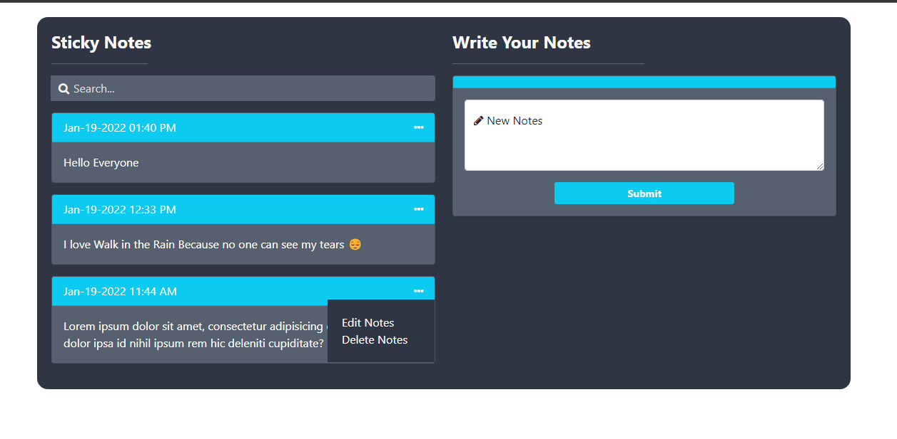
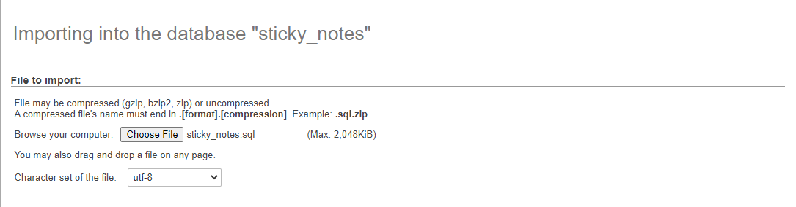

# Sticky_Notes

<b>Body</b>

In this repository we will create a <b>Simple Sticky Notes App</b> using <b>PHP</b>. <b>PHP</b> is a server-side scripting language designed primarily for web development. Using PHP, you can let your user directly interact with the script and easily to learned its syntax. It is mostly used by newly coders for its user-friendly environment.

### So Let's do the coding...
## Getting started:

First you have to download & install XAMPP or any local server that run PHP scripts. Here's the link for XAMPP server <a target="_blank" href="https://www.apachefriends.org/index.html">https://www.apachefriends.org/index.html</a>.

And this is the link for the bootstrap that has been used for the layout <a target="_blank" href="https://getbootstrap.com/">https://getbootstrap.com/</a>.

## Creating Database

Open your database web server then create a database name in it <code>sticky_notes</code>. After that, click <code>Import</code> then locate the database file inside the folder of the application then click ok.

There you have it we successfully created a Simple <b> Sticky Notes App</b> using <b>PHP</b>. I hope that this simple project helps you to what you are looking for. For more updates and projects just kindly visit my profile. 

<a target="_blank" href="https://github.com/Sujon-Ahmed">Sujon-Ahmed</a>

<b>Enjoy Coding!!!</b>
